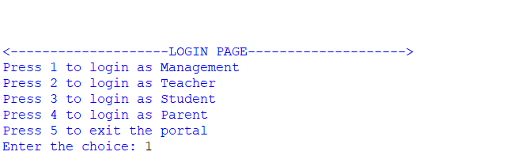
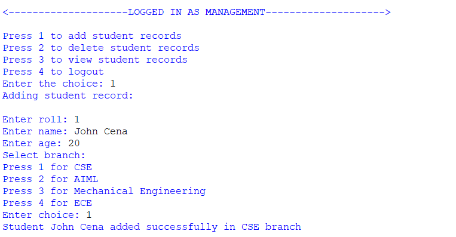
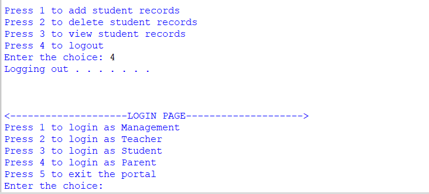
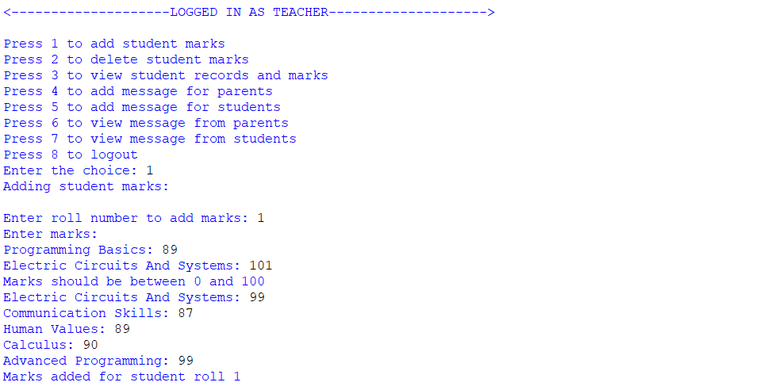
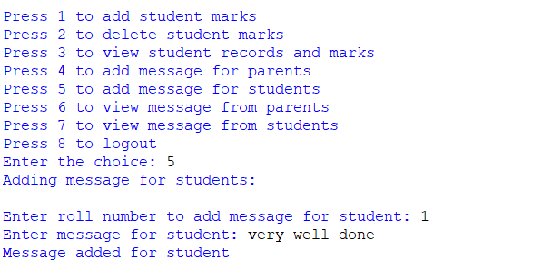
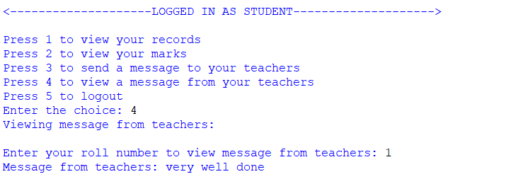
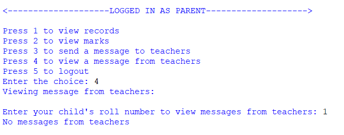
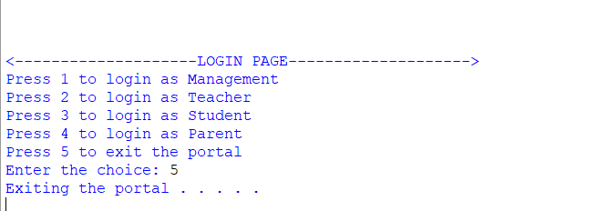

# Student Information Portal

## Overview
The Student Information Portal is a Python-based console application designed to manage student records, marks, and communication between the student and parent with the teacher. It supports role-based access for management staff, teachers, students, and parents, each with their own menu-driven interface for efficient data management.

## Features
- Role-based login and interface
- Student record addition, deletion, and viewing
- Marks addition, deletion, and viewing with subject-wise breakdown
- Messaging system for communication access between the parents, teachers, and students
- Input validation and error handling

## Technologies/Tools Used
- Python 3.x 
- Console for taking the input and displaying the output

## Steps to Install & Run the Project
1. Go to the GitHub repository page.
2. Check for `project_student_portal.py` in the file list.
3. Click on the file name to view its contents.
4. Click the 'Raw' button at the top right of the file viewer.
5. Right-click on the page and select 'Save As' to download the file to your computer.
6. Ensure Python 3.x is installed on your system.
7. Run the Python program using any compiler.

## Instructions for Testing
- Log in as each user role to test different features provided by the program.
- Add, delete, and view student records as a management staff member.
- Manage marks for various subjects and students as a teacher.
- Send and view messages between teachers, students, and parents.
- Try invalid inputs to test error handling and validation.

## Screenshots

### 1. Login Page

### 2. Logging In as Management

### 3. Logging Out

### 4. Logging In as Teacher

### 5. Viewing Student Marks and Records (Corrected Path)

### 6. Adding Message for Student

### 7. Viewing Message as Student

### 8. Viewing Messages as Parent

### 9. Exiting Portal

